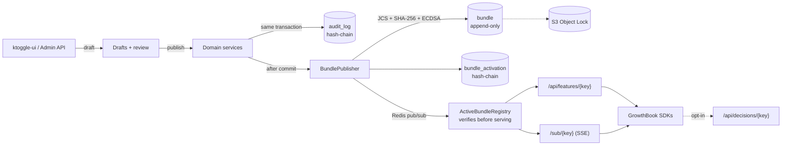

# ktoggle

KTO's feature flag service. It keeps **the same SDKs as GrowthBook** and makes **every decision reliably auditable,
regardless of version**.

## Why ktoggle

- **Compatible with the GrowthBook SDKs.** `GET /api/features/{clientKey}` and `GET /sub/{clientKey}` (SSE) use
  GrowthBook's format. To move a consumer over, change the API host.
- **Drafts and four-eyes review.** Every change to an existing feature is staged in a draft and reviewed as a diff.
  Protected environments require an approval from someone else. Who may approve is configurable. Admins can publish
  in an emergency with a mandatory reason, and that publication is flagged in the audit trail.
- **Configuration published as immutable bundles.**
  - Each publication produces canonical JSON (RFC 8785), identified by its SHA-256 and signed with ECDSA P-256
    (AWS KMS in stg/prd).
  - Bundles are stored in Postgres (append-only, enforced by triggers) and copied to S3 with Object Lock (WORM).
  - The activations of each client key are hash-chained, so any tampering is detectable.
- **Deterministic replay.** `POST /admin/v1/replay` reproduces any decision from the bundle it was made with, using
  the official `growthbook-sdk-java`. Nothing that changed afterwards affects the result.
- **Delivery log.** Records which bundle each client key received and when, without changing consumers.
- **Opt-in decision log, privacy-aware (LGPD).** Consumers may send their decisions through the SDK's feature-usage
  callback. Personal data is never stored in clear: ktoggle keeps only an HMAC of it.
- **Control-plane audit trail.** Every change records who, what, when and why (`X-Ktoggle-Reason` header), in a
  hash-chained trail that can be verified with `GET /admin/v1/audit/verify`.



## Running it

**Full demo, only Docker needed.** Clone `ktoggle-ui` next to this repository, then:

```bash
docker compose --profile app up -d --build     # UI http://localhost:5173 — sign in as admin.local / admin
docker compose --profile app down -v           # stop and reset the demo data
```

**Development.** Run the infrastructure in Docker and the apps from your IDE or the terminal:

```bash
docker compose up -d                                              # Postgres :5434, Redis :6390, Keycloak :8180
./mvnw spring-boot:run -Dspring-boot.run.profiles=local,demo      # API :8090 (the demo profile seeds sample data)
cd ../ktoggle-ui && npm install && npm run dev                    # UI :5173
# Swagger: http://localhost:8090/swagger-ui.html  (dev users: local-infra/keycloak/README.md)
```

Suggested demo script:
1. **Features → `new-checkout` → Production:** show the rules (beta testers plus a 25% rollout in BR) and the
   "Test feature" panel.
2. **Draft and approval (four eyes):**
   - As `editor.local`, change a rule in Production. A draft opens and nothing changes for the SDKs.
   - In "Review & publish", show the diff and click "Request review".
   - As `approver.local`, approve it on the **Reviews** page.
   - As `editor.local` again, publish it.
   - In **Settings**, show who can approve and which environments require approval.
3. **A/B experiment:** `deposit-button-copy` splits players between three button copies. Use "Test feature" with
   different `id` values to see each user's variation; the SDK reports every exposure to its tracking callback
   (Mixpanel in production), which the playground log shows.
   **Scheduled rule:** `welcome-bonus` in Production has a "Black Friday boost" that only goes live from Nov 27 to
   Dec 1. Use "Evaluate at" in the Test feature panel to preview it; the SDK payload only gets the rule inside its
   window, and each start and end shows up in the activation chain as `system:scheduler`.
   **Prerequisite:** `instant-cashback` only applies to users who get `new-checkout` (shown under Prerequisites, and
   as a dependent on `new-checkout`). In "Test feature", a user outside the checkout rollout gets it off.
4. **SDK playground:** connect `Demo · App (staging)`. In another tab, publish a change in Staging and watch it arrive
   over SSE in under a second.
5. **SDK connections:** show the active bundle with its verified hash and signature, the verified chain and a rollback
   with a reason.
6. **Audit log:** show the hash-chained trail (who, what, when and why) and the integrity indicator.
7. **Replay:** replay a decision from an old bundle and show that the result does not change after the current
   configuration changed.

A minimal API flow as `admin.local` (see `local-infra/keycloak/README.md` for getting a token):

```bash
H="Authorization: Bearer $TOKEN"; J="Content-Type: application/json"; API=http://localhost:8090/admin/v1
curl -sH "$H" -H "$J" $API/features -d '{"key":"my-flag","valueType":"BOOLEAN","defaultValue":false}'
curl -sH "$H" -H "$J" $API/features/my-flag/drafts -d '{"title":"Turn on in staging"}'          # -> draft id + version
curl -sX PUT -H "$H" -H "$J" $API/drafts/<draftId>/environments/stg \
  -d '{"enabled":true,"version":0,"rules":[{"type":"force","enabled":true,"condition":{"country":"BR"},"value":true}]}'
curl -sX POST -H "$H" -H "X-Ktoggle-Reason: pilot in BR" $API/drafts/<draftId>/publish
curl -s http://localhost:8090/api/features/sdk-demostg00001        # GrowthBook payload + bundleHash
curl -N http://localhost:8090/sub/sdk-demostg00001                  # SSE
```

## Testing with a GrowthBook SDK

Any official GrowthBook SDK can point at the local ktoggle: set `apiHost=http://localhost:8090` and use the
`clientKey` of an SDK connection. ktoggle is a standalone product and is not integrated with any other KTO service
yet.

## Main endpoints

| Area | Endpoints |
|---|---|
| SDK | `GET /api/features/{clientKey}`, `GET /sub/{clientKey}`, `POST /api/decisions/{clientKey}` |
| Features | `/admin/v1/features` (create, list, get, `/revisions`) |
| Drafts | `/admin/v1/features/{key}/drafts`, `/admin/v1/drafts/{id}` (`/environments/{env}`, `/metadata`, `/request-review`, `/approve`, `/request-changes`, `/comments`, `/rebase`, `/publish`, `/discard`), `/admin/v1/settings/review` |
| Catalog | `/admin/v1/{projects,environments,attributes,saved-groups,sdk-connections}` |
| Bundles | `/admin/v1/bundles/{hash}`, `/admin/v1/sdk-connections/{ck}/{bundles,activations,activations/at,activations/verify,deliveries}`, rollback `POST .../bundles/{hash}/activate`, `POST .../unpin` |
| Audit | `/admin/v1/audit`, `/admin/v1/audit/verify`, `/admin/v1/decisions`, `/admin/v1/decisions/{id}/verify-attributes` |
| Evaluation | `POST /admin/v1/simulate`, `POST /admin/v1/replay`, `POST /admin/v1/replay/at` |

## Roadmap

- **Done:** flags and targeting, A/B experiment rules, scheduled rules, prerequisites, saved groups (all / any / none), API tokens, drafts with configurable review and approval, auditable bundles, replay, delivery and
  decision logs, admin UI (`ktoggle-ui`), one-command demo.
- **Next:** notifications, per-project permissions, encrypted payloads and remote evaluation.
- **After the evaluation:** how ktoggle is rolled out inside the company.

See the [development guide](docs/DEVELOPMENT.md) for conventions and code invariants.
