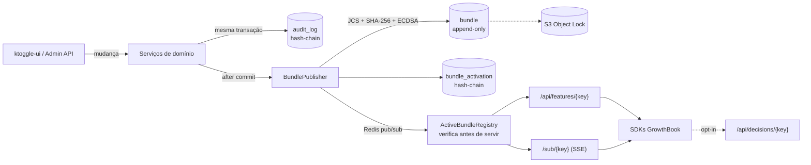

# ktoggle

O serviço de feature flags da KTO. O objetivo é substituir o GrowthBook mantendo **os mesmos SDKs** e garantir que
**toda decisão seja auditável de forma confiável, independente da versão**.

## Por que ktoggle

- **Compatível com os SDKs do GrowthBook.** `GET /api/features/{clientKey}` e `GET /sub/{clientKey}` (SSE) usam o
  mesmo formato do GrowthBook. Para migrar um consumidor, basta trocar o host da API.
- **Configuração publicada como bundles imutáveis.**
  - Cada publicação gera um JSON canônico (RFC 8785), identificado pelo seu SHA-256 e assinado com ECDSA P-256
    (AWS KMS em stg/prd).
  - O bundle fica no Postgres (append-only, protegido por trigger) e é copiado para S3 com Object Lock (WORM).
  - A sequência de ativações de cada client key é encadeada por hash, então qualquer adulteração é detectável.
- **Replay determinístico.** `POST /admin/v1/replay` reproduz qualquer decisão a partir do bundle em que ela foi
  tomada, usando o próprio `growthbook-sdk-java`. Nada que mudou depois interfere no resultado.
- **Log de entregas.** Registra qual bundle cada client key recebeu e quando, sem exigir mudança nos consumidores.
- **Log de decisões (opt-in) com LGPD.** Os consumidores podem enviar suas decisões pelo callback de uso de
  features do SDK. Atributos sensíveis nunca são guardados em claro: o ktoggle guarda apenas um HMAC deles.
- **Auditoria do control plane.** Cada mudança registra quem fez, o quê, quando e por quê (header `X-Ktoggle-Reason`),
  numa trilha encadeada por hash e verificável com `GET /admin/v1/audit/verify`.



## Rodando localmente

```bash
docker compose up -d                                              # Postgres :5434, Redis :6390, Keycloak :8180
./mvnw spring-boot:run -Dspring-boot.run.profiles=local,demo      # API :8090 (o perfil demo popula dados fictícios)
cd ../ktoggle-ui && npm install && npm run dev                    # UI :5173 — login admin.local / admin
# Swagger: http://localhost:8090/swagger-ui.html  (usuários de dev: local-infra/keycloak/README.md)
```

Roteiro sugerido para a demonstração:
1. **Features → `new-checkout` → Produção:** mostre as regras (beta testers + rollout de 25% no BR) e o painel
   "Testar feature".
2. **Draft e aprovação (quatro olhos):** como `editor.local`, altere uma regra em Produção. Um draft é aberto e nada
   muda para os SDKs. Em "Revisar e publicar", veja o diff e clique em "Solicitar revisão". Depois, como
   `approver.local`, aprove na página **Revisões**. De volta como `editor.local`, publique. Em **Configurações**,
   mostre quem aprova e quais ambientes exigem aprovação.
3. **SDK playground:** conecte `Demo · Web (produção)`. Em outra aba, ligue ou altere uma flag e veja a mudança chegar
   via SSE em menos de 1 segundo.
4. **Conexões de SDK:** mostre o bundle ativo com hash e assinatura verificados, a cadeia íntegra e um rollback com
   motivo.
5. **Audit log:** mostre a trilha encadeada (quem, o quê, quando e por quê) e o indicador de integridade.
6. **Replay:** reproduza uma decisão a partir de um bundle antigo e mostre que o resultado não muda, mesmo depois de a
   configuração atual mudar.

Um fluxo mínimo, autenticado como `admin.local` (veja como obter o token em `local-infra/keycloak/README.md`):

```bash
H="Authorization: Bearer $TOKEN"; J="Content-Type: application/json"; API=http://localhost:8090/admin/v1
curl -sH "$H" -H "$J" $API/environments -d '{"key":"prd","name":"Produção"}'
curl -sH "$H" -H "$J" $API/attributes   -d '{"key":"country","datatype":"STRING","pii":false}'
curl -sH "$H" -H "$J" $API/sdk-connections -d '{"name":"player-service","environmentKey":"prd"}'   # -> clientKey
curl -sH "$H" -H "$J" $API/features -d '{"key":"new-checkout","valueType":"BOOLEAN","defaultValue":false}'
curl -sX PUT -H "$H" -H "$J" -H "X-Ktoggle-Reason: piloto BR" $API/features/new-checkout/environments/prd \
  -d '{"enabled":true,"version":0,"rules":[{"type":"force","enabled":true,"condition":{"country":"BR"},"value":true}]}'
curl -s http://localhost:8090/api/features/<clientKey>          # payload GrowthBook + bundleHash
curl -N http://localhost:8090/sub/<clientKey>                    # SSE
```

## Testando com um SDK do GrowthBook

Qualquer SDK oficial do GrowthBook pode apontar para o ktoggle local: basta usar `apiHost=http://localhost:8090` e
o `clientKey` criado na conexão de SDK. O ktoggle é um produto independente e, por enquanto, não está integrado a
nenhum outro serviço da KTO.

## Endpoints principais

| Área | Endpoint |
|---|---|
| SDK | `GET /api/features/{clientKey}`, `GET /sub/{clientKey}`, `POST /api/decisions/{clientKey}` |
| Features | `/admin/v1/features` (CRUD, `/environments/{env}`, `/toggle`, `/archive`, `/revisions`, `/restore`) |
| Catálogo | `/admin/v1/{projects,environments,attributes,saved-groups,sdk-connections}` |
| Bundles | `/admin/v1/bundles/{hash}`, `/admin/v1/sdk-connections/{ck}/{bundles,activations,activations/at,activations/verify,deliveries}`, rollback `POST .../bundles/{hash}/activate`, `POST .../unpin` |
| Auditoria | `/admin/v1/audit`, `/admin/v1/audit/verify`, `/admin/v1/decisions`, `/admin/v1/decisions/{id}/verify-attributes` |
| Avaliação | `POST /admin/v1/simulate`, `POST /admin/v1/replay`, `POST /admin/v1/replay/at` |

## Roadmap

- **Backend (pronto):** flags + targeting, drafts com revisão e aprovação configurável, bundles auditáveis, replay, log de entregas e de decisões.
- **Em andamento:** UI administrativa (`ktoggle-ui`) para demonstração local completa.
- **A decidir depois da demonstração:** regras de experimento, regras agendadas, prerequisites,
  payload criptografado e a forma de levar o ktoggle para dentro da empresa.

Veja o [guia de desenvolvimento](docs/DEVELOPMENT.md) para as convenções e os invariantes do código.
